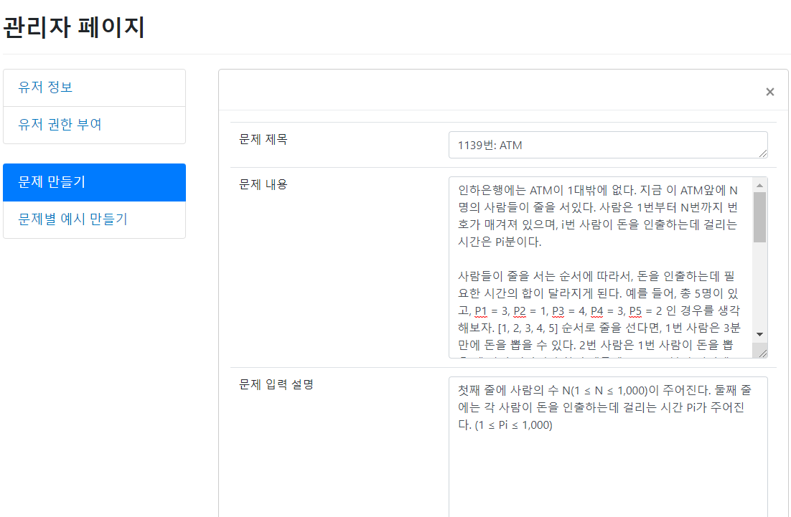
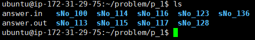
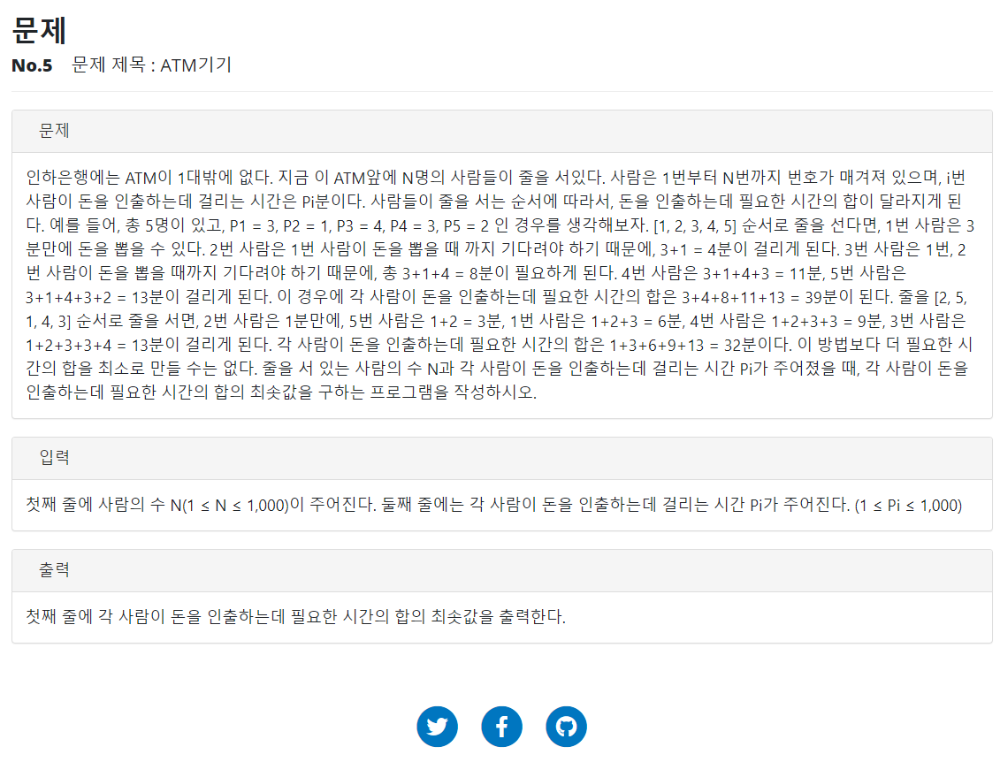
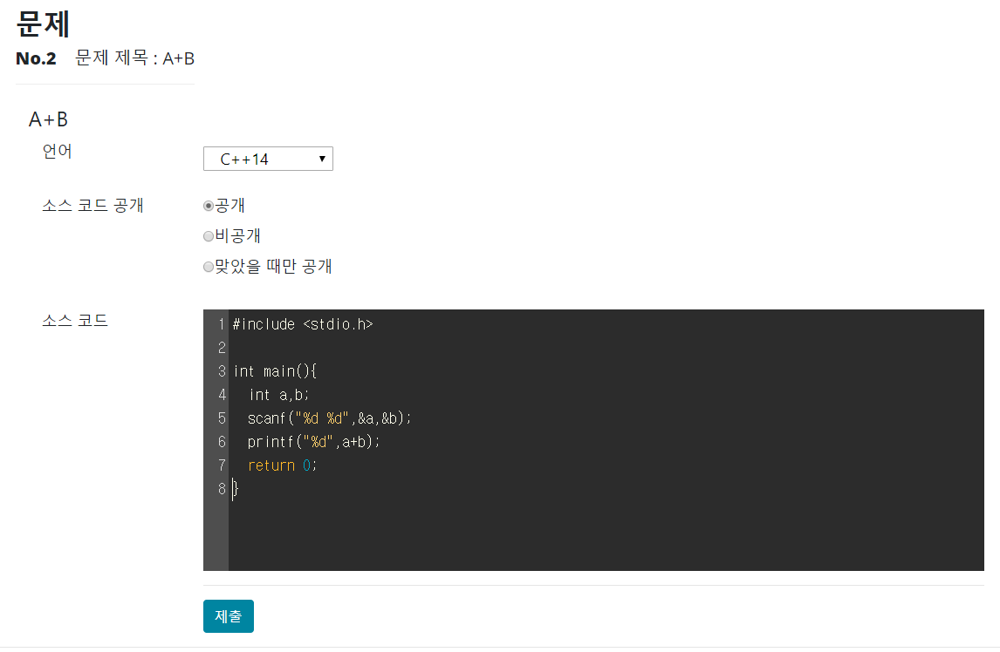
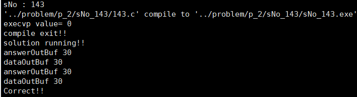
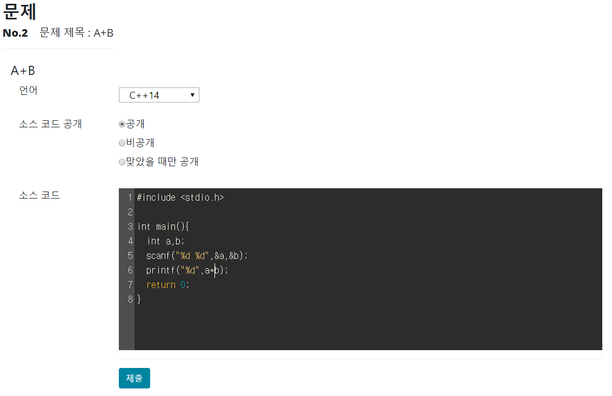
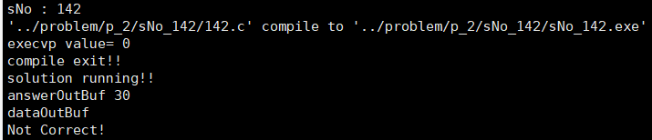
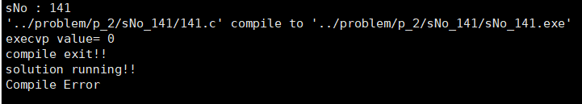
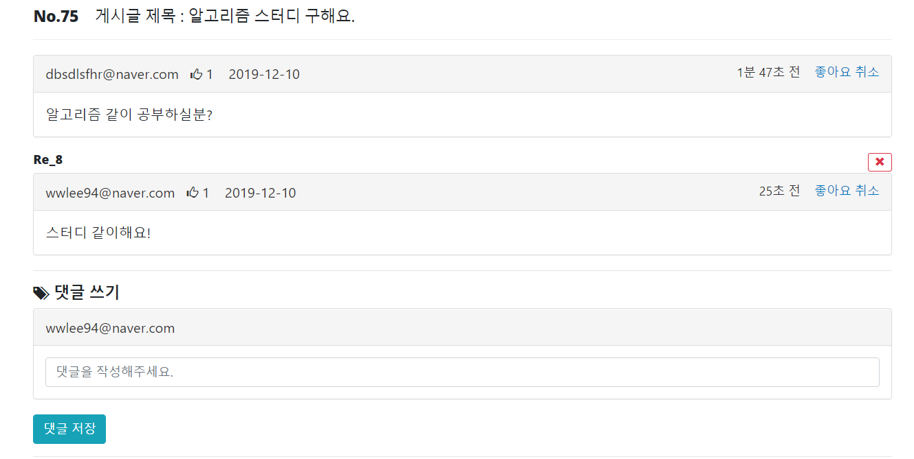

# TimeManager

## Spring 온라인 저지 사이트

#### 서비스 개요
웹 사이트 상에서 문제를 보고 코드를 직접 작성해 채점 여부를 알려주는 온라인 저지 사이트

#### 🧑‍💻온라인 저지 사이트를 만들게 된 이유?
백준 온라인 저지 사이트 (https://www.acmicpc.net) 를 접하면서 유저의 코드가 어떻게 돌아가고 컴파일 되어 채점되는지 궁금해서 만든 카피 프로젝트

## 서비스 구성도
(추가 예정)

## 서비스 주요 기능 설명
* 문제를 보고 C언어로 코드를 작성하여 컴파일 결과를 얻을 수 있다.
* 전체 유저의 채점 결과 목록을 조회할 수 있는 기능
* 질의 응답이 가능한 게시판 제공
* 게시판 댓글 및 좋아요 기능 제공

## 서비스 세부 설명

### 1. 알고리즘 문제 생성 및 조회 기능
#### 알고리즘 문제 생성
<!-- 관리자 페이지 -->
 

#### 알고리즘 입력 값, 출력 값 저장

관리자가 알고리즘 문제를 생성해 등록 한 후 채점 서버에 해당 문제의 예시 입력 및 출력값을 저장합니다.

#### 저장된 문제 확인
<!-- atm기기 문제 -->

최종적으로 생성된 문제는 코드를 작성해 문제를 풀 수 있습니다.

### 2. 알고리즘 채점 기능
#### 코드미러를 이용한 코드 작성
<!-- 코드 작성 -->

문제를 보고 C로 작성된 코드를 작성해 제출 할 수 있습니다.

#### 제출 후엔 채점 서버로 보내져 실시간으로 채점
#### 1. 정답 코드인 경우 (A+B 문제)
<!-- 정답 코드 -->

정답 코드 작성 후 제출 하면 Correct 결과 반환

#### 2. 오답 코드인 경우 (A+B 문제)
<!-- 오답 코드 -->

오답 코드 작성 후 제출 하면 Not Correct 결과 반환

#### 3. 컴파일 오류 코드인 경우 (A+B 문제)
<!-- 컴파일 오류 코드 -->

컴파일 에러 코드 작성 후 제출 하면 Compile Error 결과 반환

### 3. 온라인 저지 채점 현황 조회
<!-- 컴파일 최종 결과 -->

### 4. 질의 응답 가능한 게시판
<!-- 게시판 -->

#### 게시판 댓글 및 좋아요 기능
<!-- 댓글 및 좋아요 -->

<!-- ## 참고 문헌
* https://startlink.blog/2015/12/21/boj%EB%8A%94-%EC%96%B4%EB%96%BB%EA%B2%8C-%EB%A7%8C%EB%93%A4%EC%96%B4%EC%A1%8C%EC%9D%84%EA%B9%8C/

* https://www.acmicpc.net/help/judge

* https://github.com/hahnlee/ipytracer -->

