# Online Judge ! 

<!-- 웹 사이트 로고 -->


## Spring 온라인 저지 사이트

## 서비스 개요
웹 사이트 상에서 문제를 보고 코드를 직접 작성해 채점 여부를 알려주는 온라인 저지 사이트

### 🧑‍💻온라인 저지 사이트를 만들게 된 이유?
백준 온라인 저지 사이트 (https://www.acmicpc.net) 를 접하면서 유저가 제출한 코드가 어떻게 돌아가고 컴파일 되어 채점되는지 궁금하고 도전해보고 싶어서 만든 카피 프로젝트

## 🗒 서비스 구성도
<!-- 서비스 구성도 -->
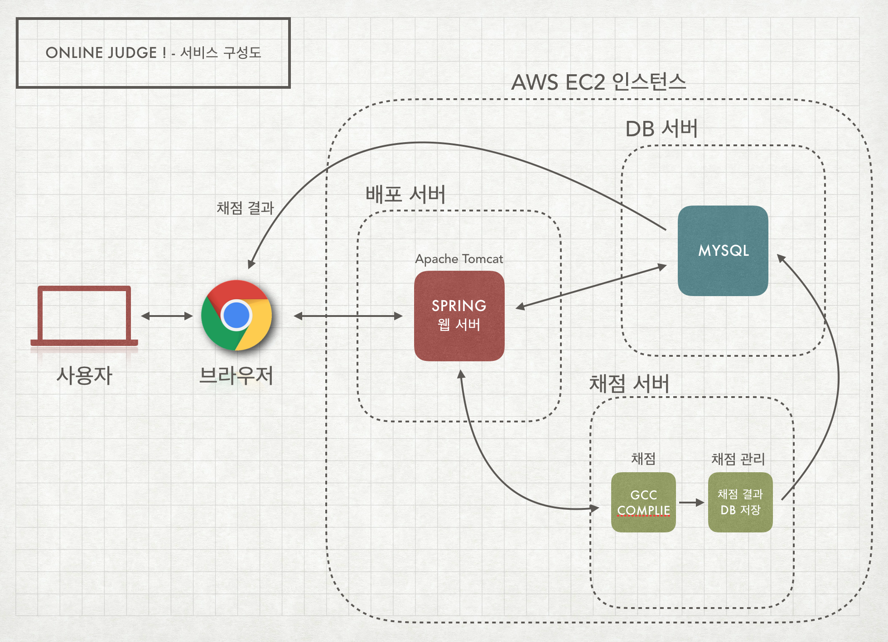 

## 서비스 주요 기능
* 문제를 보고 C언어로 코드를 작성하여 컴파일 결과를 얻을 수 있다.
* 전체 유저의 채점 결과 목록을 조회할 수 있는 기능
* 질의 응답이 가능한 게시판 제공
* 게시판 댓글 및 좋아요 기능 제공

## 서비스 기능 설명 및 동작 방식

### 1. 알고리즘 문제 생성 및 조회 기능
#### - 알고리즘 문제 생성
<!-- 관리자 페이지 -->
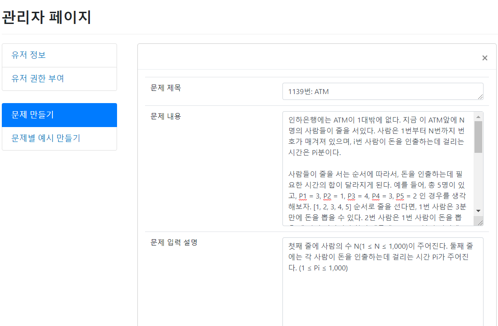 

관리자가 알고리즘 문제를 생성해 등록할 수 있습니다.

#### - 저장된 문제 확인
<!-- atm기기 문제 -->
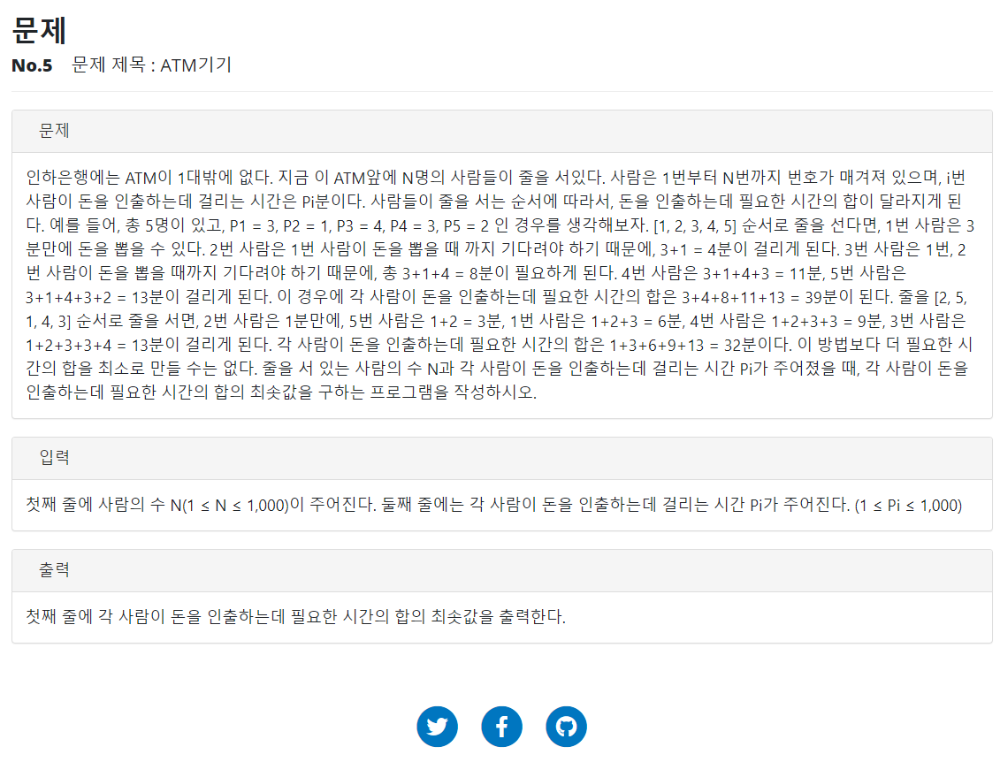

#### - 알고리즘 입출력값 저장
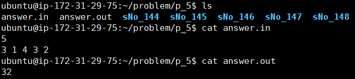

채점 서버에 해당 문제의 예시 입력 및 출력값을 저장합니다.  
> answer.in: 문제의 입력값  
> answer.out: 문제의 출력값  
> sNo_{number}: 문제를 제출한 사용자 ID번호

최종적으로 생성된 문제는 코드를 작성해 문제를 풀 수 있습니다.

### 2. 알고리즘 채점 기능
#### - 코드미러를 이용한 코드 작성 가능
<!-- 코드 작성 -->
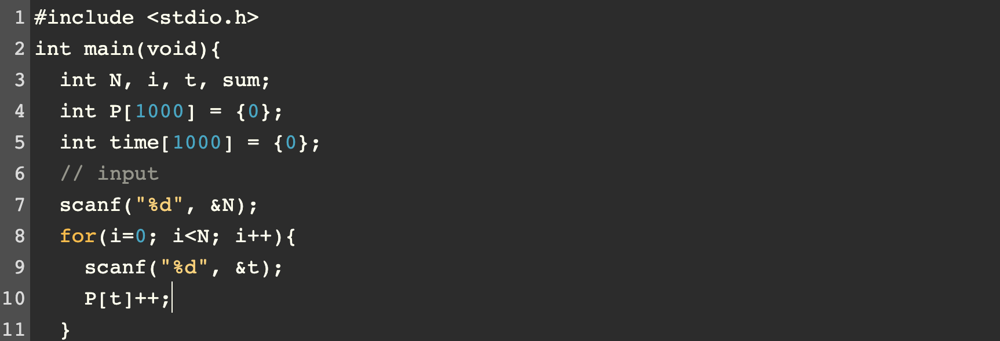

원하는 문제를 선택 후 C언어로 코드를 작성해 제출 할 수 있습니다.

#### - 코드 제출 후엔 채점 서버로 보내져 실시간으로 채점 ( 배열의 합 문제 )
#### 1. 정답 코드인 경우
<!-- 정답 코드 -->
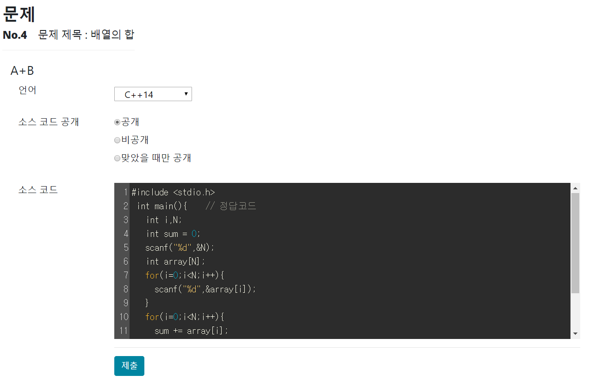

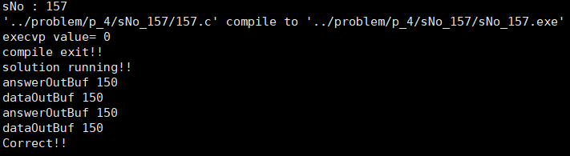

정답 코드 작성 후 제출 하면 Correct 결과 반환

#### 2. 오답 코드인 경우
<!-- 오답 코드 -->
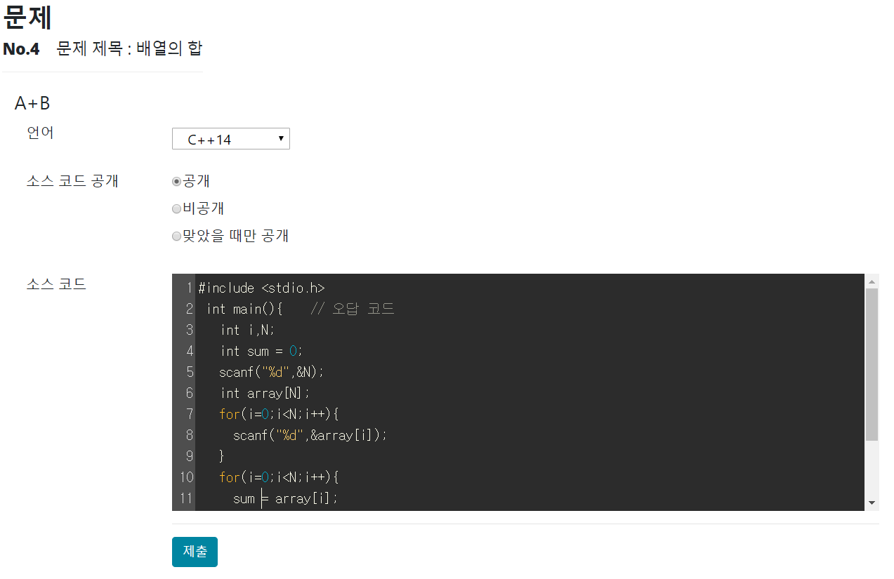

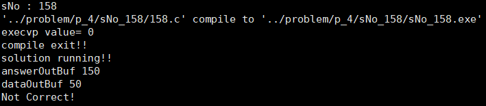

오답 코드 작성 후 제출 하면 Not Correct 결과 반환

#### 3. 컴파일 오류 코드인 경우
<!-- 컴파일 오류 코드 -->
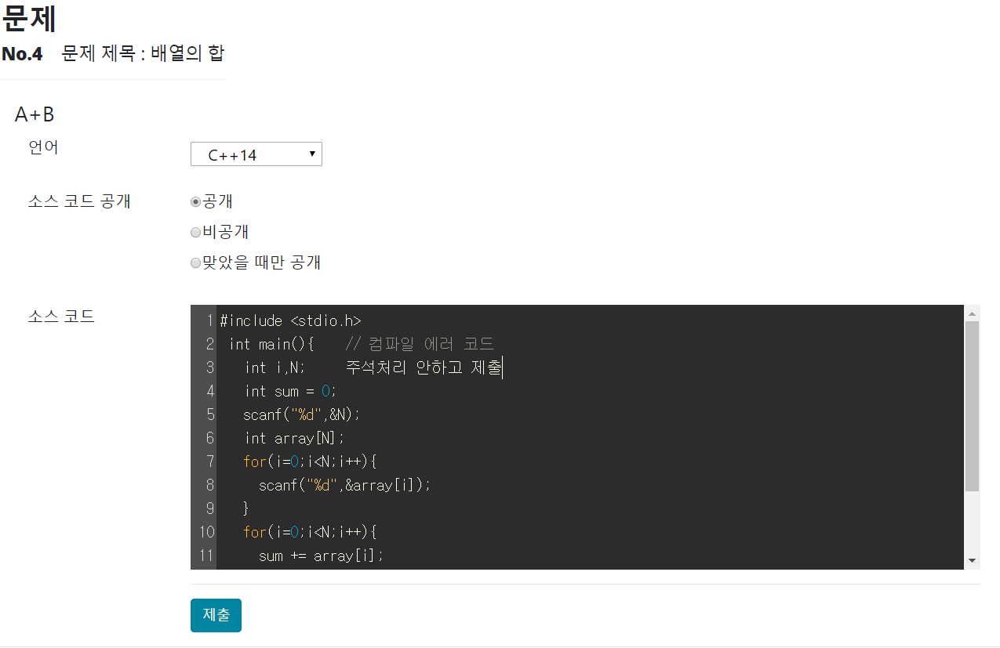

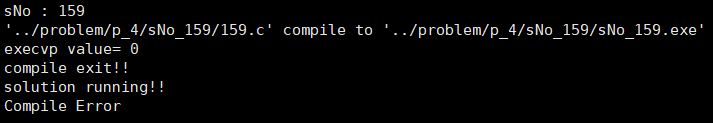

컴파일 에러 코드 작성 후 제출 하면 Compile Error 결과 반환

### 3. 서버에 저장되는 파일 정보
```
.c 파일: 사용자가 제출한 C 코드
.exe 파일: c 코드를 컴파일 후 실행파일로 만든 것
data.out: .exe파일을 실행 시킨 후 나온 표준 출력 파일
error.out: .exe파일을 실행 시킨 후 나온 표준 에러 파일
```
#### 1. 정답 코드
<!-- 정답코드 컴파일 정보 -->
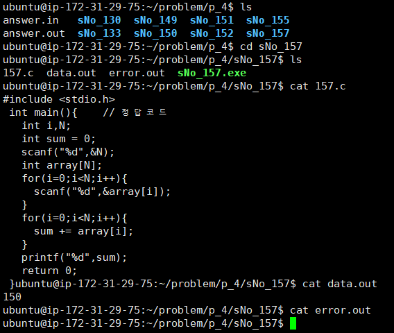

#### 2. 컴파일 에러 코드

<!-- 컴파일에러코드 컴파일 정보 -->
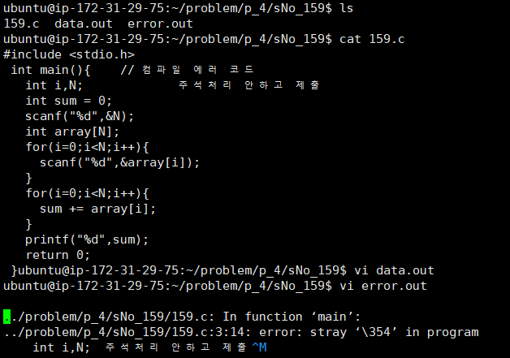

### 4. 온라인 저지 채점 현황 조회
<!-- 컴파일 최종 결과 -->
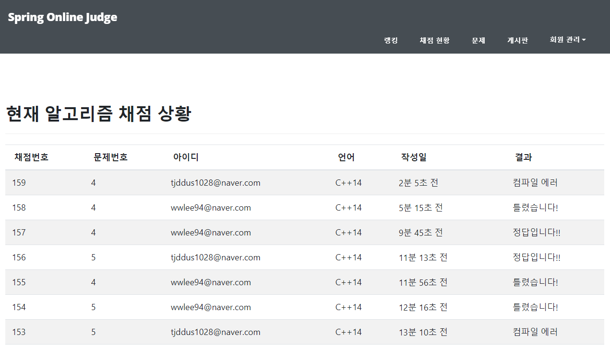

### 5. 질의 응답 가능한 게시판
<!-- 게시판 -->


#### - 게시판 댓글 및 좋아요 기능
<!-- 댓글 및 좋아요 -->


## 서버 정보 ( AWS EC2 인스턴스 )

### 1. 채점 서버 ( C로 구현 )
* C언어 코드 컴파일 제공 - g++ (GCC) 8.3.0 버전
* 채점 완료 후 DB서버에 정보 저장 후 웹에서 저장된 데이터 받아옴

### 2. 배포 서버
* maven 빌드 이용
* jar파일로 Spring 서버 배포

### 3. DB 서버
* MySQL - 5.0.77 버전
* 제출 된 코드, 사용자 정보, 게시판 데이터를 DB에 저장해 관리

### AWS EC2 - 서버 사양
* Version : Ubuntu 18.04.3 LTS
* CPU Model : Intel(R) Xeon(R) CPU E5-2676 v3 @ 2.40GHz
* Memory : 1GB
* OS : Ubuntu 서버

## 참고 문헌 및 웹 사이트
* [백준 채점 도움말](https://www.acmicpc.net/help/judge) : 컴파일러 정보와 채점 서버 정보

* [코드패드](http://codepad.org) : 컴파일 동작 디자인 및 방식 참고

* [개발자 부엉](https://bubobubo003.tistory.com/26) : 컴파일러 구현 언어는 다르지만 내부 동작 이해하는데 큰 도움

